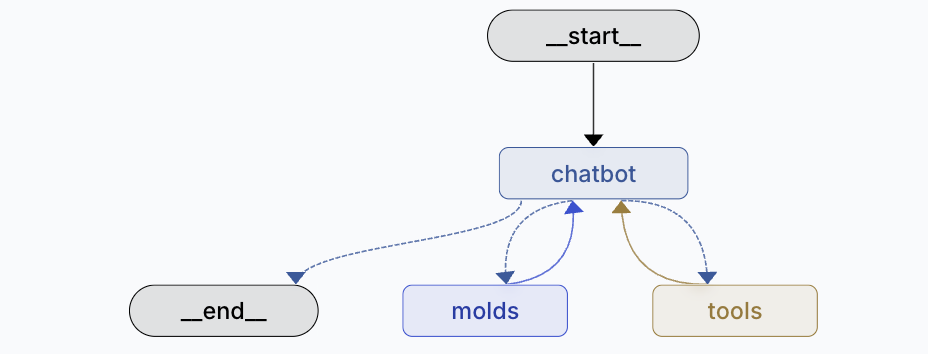

# MOLD Agent - Modular Output Learning Design



MOLD Agent is a next-generation AI agent framework that combines reasoning with structured output generation. It extends LangGraph's capabilities by introducing "molds" - schema tools that guide agents toward structured thinking and data organization.

## What is MOLD Agent?

MOLD Agent is an enhanced version of `create_react_agent` that adds schema-driven context engineering. Instead of just having tools that perform actions, MOLD agents also have "molds" that structure information and guide the agent's focus.

### Key Concepts

- **Tools**: Perform actions (API calls, calculations, data retrieval)
- **Molds**: Structure data into schemas and guide agent focus
- **Dynamic State**: Automatically creates state fields based on your molds

## Why MOLD Agent?

### 🎯 Context Engineering
Molds help agents focus on what information to collect. When you define a schema, the agent understands what data points to look for when calling other tools.

### 🏗️ Schema-Driven Thinking
Instead of free-form responses, agents can structure their thinking around predefined schemas, making outputs more consistent and focused.

### ⚡ Easy Schema Adjustment
Change your Pydantic model, and the agent automatically adapts its focus. No need to rewrite prompts or logic.

### 🔄 Dynamic State Management
The agent automatically creates state fields based on your molds, eliminating manual state configuration.

## 🚀 How It Works

1. **Define Pydantic Models** for your data structures
2. **Create Mold Functions** using the `@mold` decorator
3. **Build Your Agent** with `create_mold_agent()`
4. **Write System Prompts** that reference both tools and molds

## 📝 Basic Example

```python
from typing import Literal
from typing_extensions import TypedDict
from create_mold_agent import create_mold_agent, mold

# 1. Define your data schema
class WeatherData(TypedDict):
    city: str
    temperature: float
    humidity: float
    wind_speed: float
    status: Literal["success", "error"]

# 2. Create a mold function
@mold
def weather_report(weather: WeatherData, tool_call_id: str) -> Command:
    """Structure weather data into organized format"""
    return Command(
        update={
            "weather": weather,
            "messages": [ToolMessage(json.dumps({"weather": weather}, indent=2), 
                                   tool_call_id=tool_call_id)]
        }
    )

# 3. Create your agent
agent = create_mold_agent(
    model=your_llm_model,
    tools=[get_weather_tool],
    molds=[weather_report],
    prompt="Use get_weather tool, then weather_report mold to structure the data"
)
```

## 💡 System Prompt Guidelines

When writing system prompts for MOLD agents:

- **Reference tools and molds separately**: "Use tools to gather data, then use molds to structure it"
- **Be specific about mold usage**: "Call the weather_report mold to organize the information"
- **Explain the schema purpose**: "The mold shows what information to focus on"

Example:
```
<role>You are a weather expert</role>

<core_behavior>
- Use get_weather tool to gather weather data
- Use weather_report mold to structure the information
</core_behavior>

<output>
- Present the structured mold data with clear formatting
</output>
```

## ✅ Best Practices

### 1. Schema Design
- Keep schemas focused and specific
- Use TypedDict for clear field definitions
- Include status fields for error handling

### 2. Mold Functions
- Use descriptive names that end with the data type (e.g., `weather_report`, `task_plan`)
- Include clear docstrings explaining the schema purpose
- Return Command objects for state updates

### 3. System Prompts
- Clearly distinguish between tools and molds
- Explain what information the molds are looking for
- Guide the agent on when to use each mold

## 📊 Comparison with Standard Agents

| Feature | Standard Agent | MOLD Agent |
|---------|---------------|------------|
| Data Structure | Free-form responses | Schema-driven output |
| Context Engineering | Manual prompt engineering | Automatic schema guidance |
| State Management | Manual configuration | Dynamic auto-creation |
| Focus | Tool-centric | Schema + Tool centric |
| Consistency | Variable | High (schema-enforced) |

